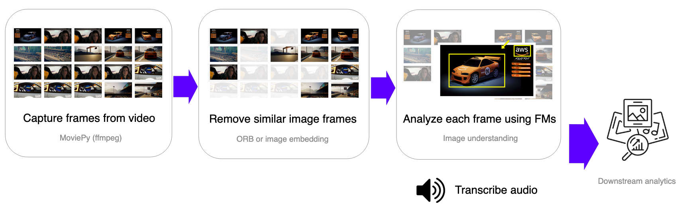
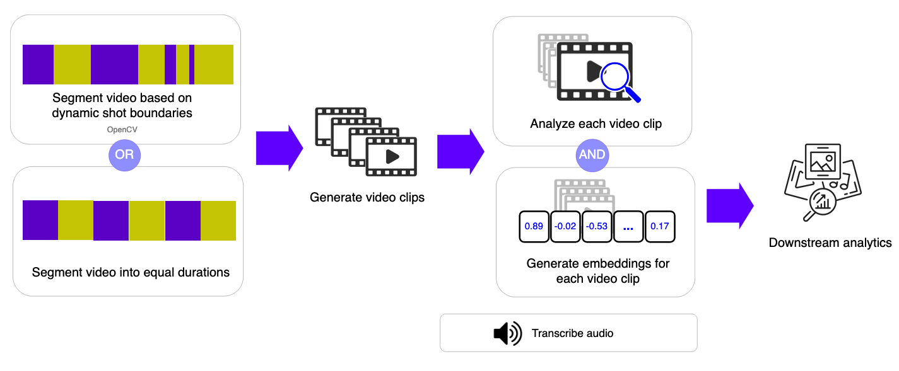
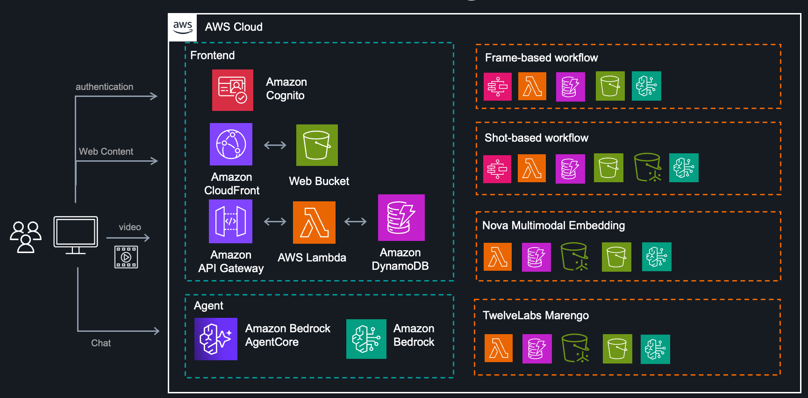
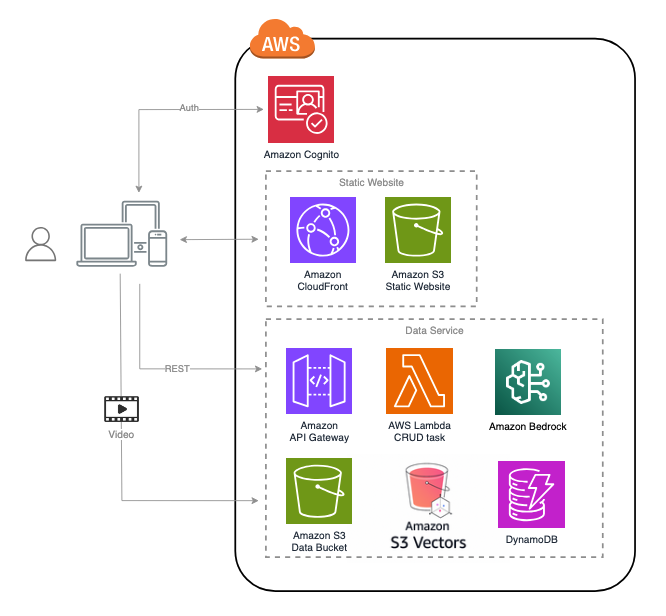

# Bedrock Video Understanding

> This solution is available as a CDK package and can be deployed to your AWS account by running just a few simple scripts.

Understanding video content is inherently complex, as it combines visual, auditory, and temporal information that must be analyzed together for meaningful insights. Different use cases — such as media scene analysis, ad break detection, IP camera tracking, or social media moderation — often require distinct workflows with varying cost, accuracy, and latency trade-offs.

An increasing number of multimodal understanding models and features are now available on Amazon Bedrock.


This video understanding tool allows you to upload videos, experiment with different analysis pipelines and foundation models on Amazon Bedrock, and compare performance across configurations. It streamlines the complex process of extracting reliable metadata from videos and provides an intuitive interface to access the results — either through the UI or programmatically — for further analysis.

## 📚 Table of Contents

- [Video Understanding Workflows](#workflows)
  - [Frame-based workflow](#frame-based-workflow)
  - [Shot-base workflow](#shot-base-workflow)
  - [Video Embedding](#video-embedding)
- [System architecture](#system-architecture)
  - [🎬 Extraction Service](#extraction-service)
  - [🤖 Nova Service](#nova-service)
  - [🧪 TwelveLabs Service](#tlabs-service)
  - [🤖 Agent Service](#agent-service)
  - [📊 Analytics Service](#analytics-service)
  - [🌐 Frontend](#frontend)
- [Deployment Instruction](#deployment-instruction)
  - [Prerequisites](#prerequisites)
    - [Install environment dependencies and set up authentication](#install-environment-dependencies-and-set-up-authentication)
    - [Supported Regions](#supported-regions)
  - [Deployment Steps](#deployment-steps)
  - [Deployment Validation](#deployment-validation)
  - [Running the Guidance](#running-the-guidance)
  - [Cleanup](#cleanup)

---

## Workflows
This video understanding tool provides three distinct workflows, each leveraging different video extraction methods.

### Frame-based workflow
A traditional approach to video analysis involves sampling image frames at fixed intervals, removing similar or redundant frames, and then applying image understanding foundation models to extract visual information at the frame level. Audio transcription is performed separately. At the end of this workflow, you obtain both visual and audio metadata that can be used for downstream analysis.




### Shot-base workflow
The shot-based workflow follows a similar concept to the frame-based approach, where visual and audio information are extracted independently. However, instead of sampling individual frames, this method segments the video into short clips (shots) or even duration clips and applies video understanding foundation models and video embedding models to each segment.

This approach leverages the flexibility of video understanding models while addressing their limitations with longer videos. By generating both semantic labels and embeddings, it enables more efficient video search and retrieval — balancing accuracy and flexibility for a wide range of use cases.



### Video Embedding
Multimodal embedding is an emerging approach to video understanding, particularly popular for video search. In this tool, we offer two workflows that leverage different video embedding models available on Amazon Bedrock: Nova Multimodal Embedding and TwelveLabs Marengo 2.7. You can upload your videos to these pipelines and perform searches using both text and image inputs.


## System Architecture


The system is composed of six logical components, each of which can be deployed independently.

<a id="extraction-service"></a>
### 🎬 **Extraction Service**
This subsystem includes two customized workflows: frame-based and shot-based. It is orchestrated using Step Functions and leverages **Amazon Transcribe** for audio transcription.

- The frame-based workflow uses an Amazon Step Functions state machine to orchestrate frame sampling, removal of similar frames, and analysis of each frame using LLM configurations from Bedrock, along with audio transcription via Amazon Transcribe. The resulting task metadata is stored in DynamoDB and on S3, ready for downstream analytics workflows.


- The shot-based workflow follows a similar architecture but with different logic. Videos are segmented either using OpenCV vision-based shot detection or fixed-duration clips. Each clip is analyzed with Bedrock LLMs and video embeddings, and the resulting metadata is stored in DynamoDB and S3 for downstream analytics.


<a id="nova-service"></a>
### 🤖 **Nova Service**
Provides the backend logic for **Nova Multimodal Embedding**.

<a id="tlabs-service"></a>
### 🧪 **TwelveLabs Service**
Provides the backend logic for **TwelveLabs Marengo Embedding**.

Both of these embedding workflows share a similar architecture, as follows:




<a id="agent-service"></a>
### 🤖 **Agent Service**
The tool includes an **Agent chatbot** that allows you to consult with an AI assistant for recommendations on the most suitable workflow and configurations for your video. The agent is powered by **Amazon Bedrock AgentCore**.

<a id="frontend"></a>
### 🌐 **Frontend Service**
A **React** static website served via **CloudFront** and backed by an **S3** bucket. It provides a user interface to select workflows, upload videos, configure settings, and view extraction results. The site also includes a chatbot UI for interacting with the consulting agent.

<a id="analytics-service"></a>
### 📊 **Analytics Service**
The tool handles upstream video analysis, extracting metadata for deeper insights. Sample notebooks demonstrate how to retrieve and use this metadata for common use cases such as IP camera monitoring, movie chapter segmentation, and social media content moderation. You can also extend these samples to build custom analyses tailored to your needs.

- [IP Camera Event Detection](./source/analytics/sample/video-understanding-ip-camera-event-detection.ipynb)
- [Media Chapter/Scene Analysis](./source/analytics/sample/video-understanding-media-chapter-analysis.ipynb)
- [Social Media Content Moderation](./source/analytics/sample/video-understanding-social-media-content-moderation.ipynb)

## Deployment Instruction
### Prerequisites

- If you don't have the AWS account administrator access, ensure your [IAM](https://aws.amazon.com/iam/) role/user has permissions to create and manage the necessary resources and components for this solution.eiifccv

#### Install environment dependencies and set up authentication

<details><summary>
:bulb: Skip if using CloudShell or AWS services that support bash commands from the same account (e.g., Cloud9). Required for self-managed environments like local desktops.
</summary>

- [ ] Install Node.js
https://nodejs.org/en/download/

- [ ] Install Python 3.12+
https://www.python.org/downloads/

- [ ] Install Git
https://github.com/git-guides/install-git

- [ ] Install Pip
```sh
python -m ensurepip --upgrade
```

- [ ] Install Python Virtual Environment
```sh
pip install virtualenv
```


- [ ] Setup the AWS CLI authentication
```sh
aws configure                                                                     
 ```                      
</details>


If your CloudShell instance has older dependency libraries like npm or pip, it may cause deployment errors. To resolve this, click 'Actions' and choose 'Delete AWS CloudShell Home Directory' to start a fresh instance.

#### Supported Regions
The solution requires AWS AI and Generative AI services, including Amazon Bedrock, Amazon Rekognition and Amazon Transcribe, which are available in certain regions. Please choose one of the below AWS regions to deploy the CDK package.

|||||
---------- | ---------- | ---------- | ---------- |
US | us-east-1 (N. Virginia) |||


### Deployment Steps
1. Clone the source code from GitHub repo 

```
git clone https://github.com/aws-samples/sample-bedrock-video-understanding
cd sample-bedrock-video-understanding
```

2. Set up environment varaibles 

Set environment variables as input parameters for the CDK deployment package:

CDK_INPUT_USER_EMAILS: Email address(es) for login to the web portal. They will receive temporary passwords.
```
export CDK_INPUT_USER_EMAILS=<EMAILS_SPLIT_BY_COMMA>
```

Update the values with your target AWS account ID and the region where you intend to deploy the demo application.
```
export CDK_DEFAULT_ACCOUNT=<YOUR_ACCOUNT_ID>
export CDK_DEFAULT_REGION=<YOUR_TARGET_REGION> (e.x, us-east-1)
```

3. Run **deploy-cloudshell.sh** in CloudShell to deploy the application to your AWS account with the parameters defined in step 2.
```
cd deployment
bash ./deploy-cloudshell.sh
```

### Deployment Validation

Once the deployment completes, you can find the website URL in the bash console. You can also find it in the CloudFormation console by checking the output in stack **BedrockMmRootStack**.

### Running the Guidance
- If you provided one or more email addresses through the environment variable `CDK_INPUT_USER_EMAILS` during setup, an email containing a username and temporary password will be sent to those addresses as part of the deployment process. Users can use these credentials to sign in to the web portal.

- If `CDK_INPUT_USER_EMAILS` was set, you will need to manually create a user by navigating to the Cognito console and adding a user to the **bedrock-mm-user-pool**.

### Cleanup

When you’re finished experimenting with this solution, clean up your resources by running the command from CloudShell:

```
cdk destroy
```

These commands deletes resources deploying through the solution. 
You can also go to the CloudFormation console, select the `BedrockMmRootStack` stack, and click the Delete button to remove all the resources.
